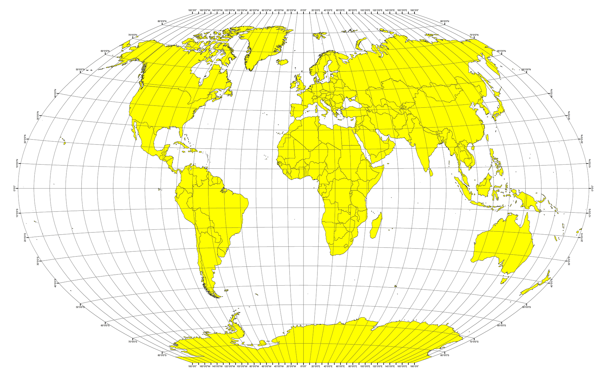

# Python API Homework - What's the Weather Like?

## Background

Whether financial, political, or social -- data's true power lies in its ability to answer questions definitively. So let's take what you've learned about Python requests, APIs, and JSON traversals to answer a fundamental question: "What's the weather like as we approach the equator?"

Now, we know what you may be thinking: _"Duh. It gets hotter..."_

But, if pressed, how would you **prove** it?

## Part I - WeatherPy

Observation and Insights

1. Latitude has a strong positive correclation to temparature in the SOuthern Hemisphere, but a strong negative correlation in the northern Hemisphere. This is due to approaching the equator.
2. Latitude does not tend to affect cloudiness, but there is a slight positive correlation to latitude.
3. Humidity has a positive correlation with latitude, but not as strong as max temp. Varies more but does get higher as you approach equator.
4. Wind speed has a higher correlation to latitude in the southern hemisphere than in the northern hemisphere.

### Copyright

Trilogy Education Services © 2020. All Rights Reserved.
